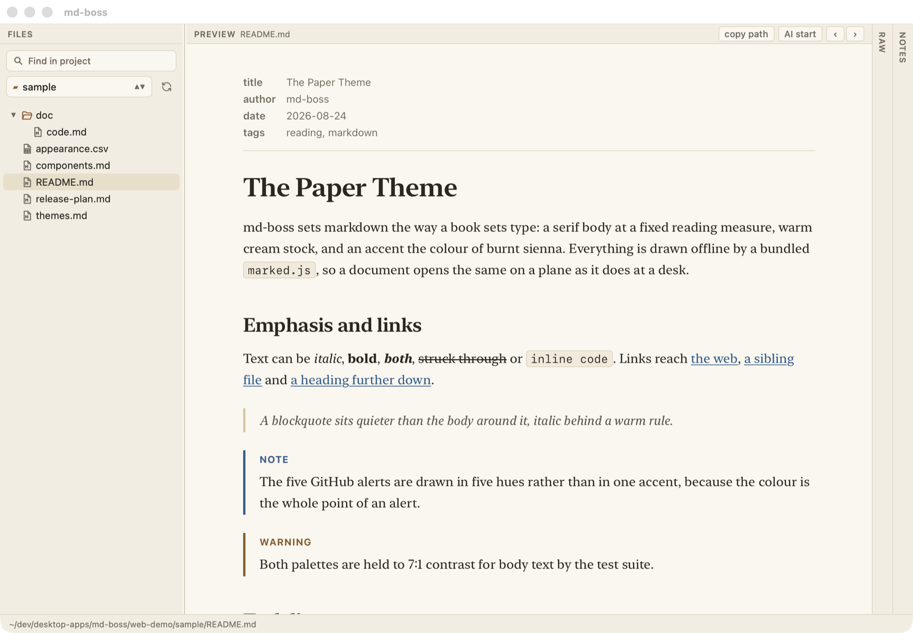
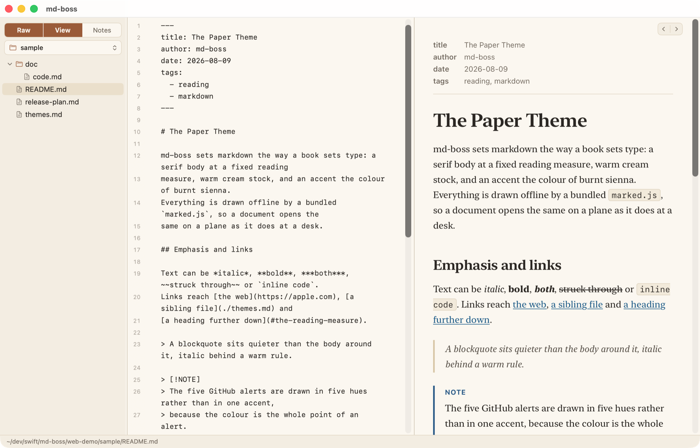
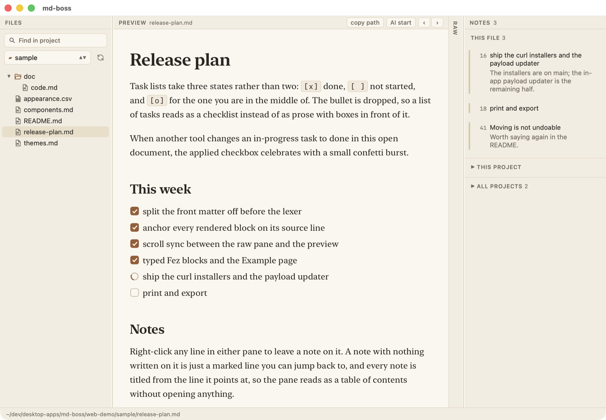
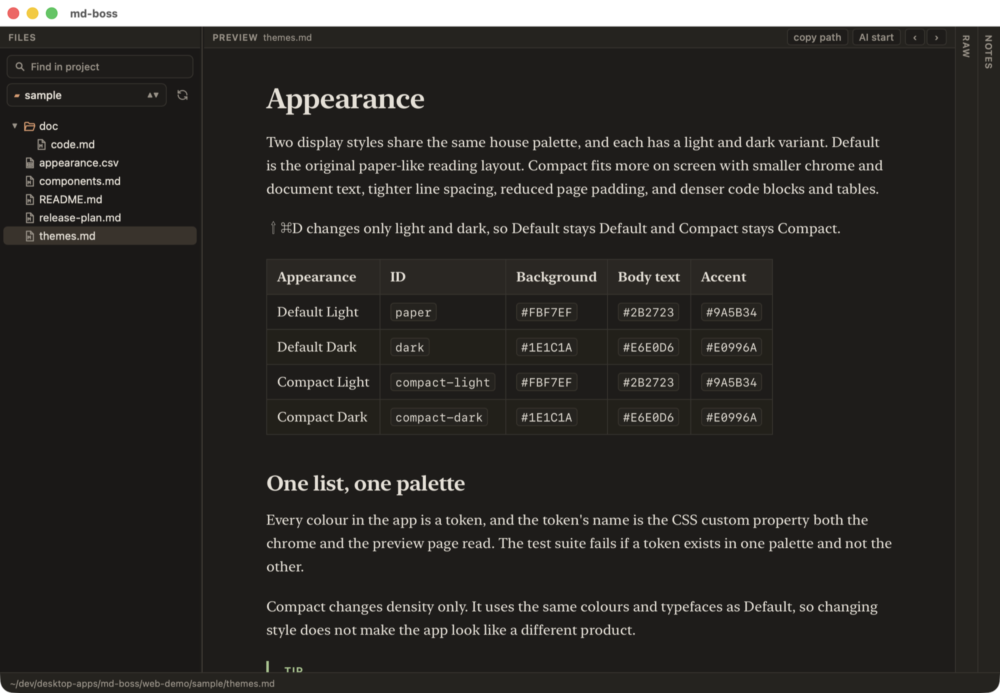

# MD-BOSS

A markdown viewer and editor that looks like paper, for macOS, Windows and Linux.

Folders and files on the left, the rendered document on the right.
Four panels sit side by side - files, preview, raw, notes - each under its own label.
Click a label and the panel folds down to a rail carrying the same label on its side; click
the rail and it comes back, so a folded panel is always its own way back.
The edges of the files and notes columns drag; preview and raw split what is left between
them.
Raw and preview scroll together, anchored on source lines rather than on percentages, so a
tall fenced block or an image does not pull the two out of step.
⇧⌘D switches between the light and dark variants of the active display style.
The `<` and `>` arrows narrow and widen the reading column.

Rendering is GitHub-flavored markdown - tables, task lists, code highlighting, and `> [!NOTE]`
alerts in five colours - done entirely offline by a bundled `marked.js` in an embedded web view.
No network, no telemetry, no account.
Long documents get a quiet linked Contents list from their second- and third-level headings.

Typed blocks such as `:::info`, `:::warning` and `:::details title="More"` render through
editable Fez components installed in `~/.config/md-boss/components`.
The component filename carries an `md-` prefix: `md-info.fez` renders `::info` or `:::info`, and
attributes on the opening line become component props.
Every component requires non-empty `<info>` and `<demo>` blocks; the Example page uses them to
show a live gallery of every installed component.
The packaged app carries the Fez runtime and the three initial components inside `dist`, so
rendering never installs a package or fetches code at runtime.

A leading `---` block is read as front matter and drawn as a dimmed key/value block above the
document, rather than as the horizontal rule and giant heading markdown would make of it.

The raw pane is highlighted too, on the same palette the preview draws: markers dimmed,
headings in the accent, code in one ink, link text apart from its destination.
A fenced block is code all the way through, so a `#` inside one stays a `#`.

Return continues a list, a quote or a task - unchecked, whatever the line above was - and an
empty item sheds its marker rather than growing another. Inside a fenced block Return is just
a newline. ⌥Return always is.

Right-click in the raw pane and pick Insert to drop in anything the preview draws - headings,
the three task states, the five alerts, a table, a fenced block. A `/` at the start of an
empty line opens the same list at the caret, and what you type after it narrows it down.

⇧⌘F searches every document in the folder, ⌘P jumps to one by name. Both take the sidebar
over rather than opening a pane, and Esc gives it back.
Search is case-insensitive until you type a capital.

The sidebar lists `.md`, `.markdown`, `.txt` and `.csv` files, and hides folders that have no
documents anywhere below them, so pointing it at a source repo shows you the docs rather than
the source tree.

A `.csv` opens as a table rather than as prose: columns keep their natural width and the page
scrolls sideways to meet them, so nothing is squeezed to fit. The delimiter is read off the
file, so a semicolon export lands in columns too.

Every document reopens where you stopped reading. Go back with the arrow in the Preview
label, with ⌫ or ⌘[, or just click the file again.

[Demo page](https://dux.github.io/md-boss/web-demo/)

## Install

macOS and Linux:

```sh
curl -fsSL https://raw.githubusercontent.com/dux/md-boss/main/install.sh | sh
```

Windows, in PowerShell:

```powershell
irm https://raw.githubusercontent.com/dux/md-boss/main/install.ps1 | iex
```

No administrator, no installer, nothing added outside your home folder except
`/Applications/MdBoss.app` on macOS. The script checks the release checksum, tells you if
`bun` is missing, and prints the one command that fixes it.

Installing this way rather than from a browser download is deliberate: `curl` sets no
quarantine attribute and `irm` writes no Mark-of-the-Web, so an unsigned build opens without
a Gatekeeper or SmartScreen prompt.

`| sh -s -- --uninstall` removes it again, leaving `~/.config/md-boss` alone.

| Paper | Raw and preview |
|---|---|
| [](web-demo/assets/paper.png) | [](web-demo/assets/split.png) |
| **Notes** | **Dark** |
| [](web-demo/assets/notes.png) | [](web-demo/assets/dark.png) |

Click any of them for the full-size image.

### From source

Three pieces, and the line between them is the whole design:

* `shell/` - a small Rust launcher: one window with the platform webview, native menus and
  dialogs, nothing else.
* `server/` - the backend, plain TypeScript run by the locally installed `bun`: files, walk,
  search, link rewrite, notes, watching.
* `src/` - the frontend, a fez + TypeScript app talking JSON-RPC to the server over a
  localhost WebSocket.

```sh
git clone https://github.com/dux/md-boss
cd md-boss
hammer install     # bun install + cargo fetch
hammer dev         # vite plus the shell pointed at it
```

Requires [Bun](https://bun.sh) (`curl -fsSL https://bun.sh/install | bash`), a stable Rust
toolchain (`rustup`) and [hammer](https://github.com/dux/hammer).
On Debian/Ubuntu the webview needs `libwebkit2gtk-4.1-dev librsvg2-dev libxdo-dev`; on
Windows, the WebView2 runtime and the MSVC build tools; on macOS, the Xcode command line
tools.

`hammer build` assembles `MdBoss.app` next to the checkout, `hammer install_app` copies it
into `/Applications`.

Releases go through the same tasks: `.github/workflows/release.yml` installs the `lux-hammer`
gem on each runner and calls `hammer frontend` once, then `hammer package --release` per
platform, so CI and your machine build the app the same way.

Bun is not bundled - the shell finds it on PATH and spawns the server with it. That is also
what makes updates cheap: the payload is `server/` and `dist/`, and the native shell rarely
changes.

## Tasks

| command | what it does |
|---|---|
| `hammer install` | `bun install` and `cargo fetch` - both sides of the toolchain |
| `hammer dev` | vite on 1430 plus the shell (`cargo run`) pointed at it - the inner loop |
| `hammer test` | `bun test` and `cargo test` |
| `hammer lint` | `tsc --noEmit` and `cargo clippy` |
| `hammer frontend` | everything platform independent: `dist/`, the icon set, the payload tarball |
| `hammer package` | build the shell and assemble the app for the platform you are on; `--release` also writes the release archive |
| `hammer build` | lint, test, then `frontend` and `package` together |
| `hammer run` | launch the bundle built here |
| `hammer install_app` | copy the bundle into `/Applications` (macOS) |
| `hammer server` | run the bun server alone on a fixed port, for poking at it with a WebSocket client |
| `hammer payload` | write `payload-<version>.tar.gz` - `server/`, `dist/`, `version.txt` |
| `hammer icon` | regenerate `icons/` from `icons/AppIcon.svg` |
| `hammer link` | put the `md-boss` command on PATH (`bin/md-boss` copied to `~/bin`) |
| `hammer demo` | serve the repo and open the demo page |

## Notes

Right-click a line in either pane to leave a note on it.
Write something or leave it blank - a note with nothing written on it is just a marked line
you can jump back to.

Every note is titled from the line it points at, so the pane reads as a table of contents
without opening anything: the first 40 characters of that line, markdown stripped out.

They are stored in a `.md-boss` JSON file at the root of the sidebar folder the document
lives under, so they can be committed alongside your notes:

```json
{
  "notes" : [
    { "line" : 42, "path" : "~/dev/notes/plan.md", "title" : "Rebuild the index first" },
    { "body" : "Needs a test.", "line" : 88, "path" : "~/dev/notes/plan.md" }
  ]
}
```

The file is watched, so editing it by hand or pulling someone else's shows up right away.

Files written before bookmarks and comments became one thing are read as they are and
rewritten in this shape the next time you touch them. A line that carried both becomes one
note with a title and a body.

## Appearance

Two display styles share the same house palette and each has a light and dark variant.
Default is the original paper-like reading layout.
Compact fits more on screen with smaller chrome and document text, tighter line spacing,
reduced page padding, and denser code blocks and tables.

Pick the style and colour mode independently in Settings or from the Appearance menu.
⇧⌘D changes only light/dark mode, so Default stays Default and Compact stays Compact.

Both palettes are gated by the test suite at 7:1 contrast for body text and 4.5:1 for
secondary text against their own backgrounds.

See [doc/THEMES.md](doc/THEMES.md).

## Moving files

Drag a file onto a folder in the sidebar, or right-click it, pick Cut, and pick "Move Here"
on the destination.
Every `[text](path)` and `` under the active folder that pointed at that file is
repointed, and its notes move with it.

The scanner that finds those links is hand-written rather than a regular expression, because
link text nests, destinations carry balanced parentheses, a code span closes only on a
backtick run of its own length, and fences are line state.
A link inside a fenced block is left alone.

Renaming does the same thing - a rename is a move that stays in its folder, so it runs the
same pass and every link to the file follows the new name.
A name that would move the file, hide it, or land on one that already exists stops the rename
rather than overwriting anything, and a file with no extension the sidebar lists becomes `.md`.

Moving and renaming are not undoable - ⌘Z belongs to the editor and undoes text, not the
filesystem.
A name collision stops the move rather than overwriting anything.

"Move to Trash" asks first, takes the file's notes with it, and says how many went.
Links pointing at it are left alone: following one says "Not found", and rewriting other
people's documents because one file went is a worse surprise than a dead link.
Getting it back is Finder's job.

Dragging a file into the raw pane inserts a relative markdown link to it instead, an image
link if it is an image.

## Command line

`md-boss` is a small launcher that execs the installed app, so paths resolve against the
shell's current directory and a second call reaches the running window:

```sh
md-boss .              # add this folder (or its git root) to the sidebar, at the top
md-boss notes/x.md     # open a file; the git root, or the file's folder, is listed
md-boss --help         # the flags, printed here rather than in a window
```

`hammer link` copies it to `~/bin`.
On Windows the install folder (`%LOCALAPPDATA%\MdBoss`) on PATH gives `md-boss file.md`
the same behaviour.

Opening a `.md` file from Finder or Explorer, or dropping a folder on the Dock icon, does
the same thing.

## Keyboard

On Windows and Linux read ⌘ as Ctrl and ⌥ as Alt; the shortcuts are the menu bar's.

| | |
|---|---|
| ⌘N | new file in the sidebar folder |
| ⌘O | add a folder to the sidebar (several at once) |
| ⇧⌘O | open a single file |
| ⇧⌘R | reveal the selection in Finder |
| ⌘⌫ | move the selected file to the Trash |
| ⌫ / ⌘[ | go back to the document you came from |
| ⌘1 ⌘2 ⌘3 ⌘4 | fold the files, preview, raw and notes panels in or out |
| ⌘← / ⌘→ | narrow and widen the reading column |
| ⌘\ | raw and preview side by side |
| ⇧⌘F | find in every document under the sidebar folder |
| ⌘P | go to a file by name |
| ⌘B / ⌘I | bold or italic the selection, or the word under the caret |
| ⌘K | make a link - a URL on the clipboard becomes the destination |
| ⇧⌘K | add or edit a note on the current line |
| ⇧⌘⌫ | delete the note on the current line |
| ⇧⌘D | switch between light and dark |
| ⎋ | cancel a pending Cut in the sidebar |
| ⌘+ / ⌘- / ⌥⌘0 | text size (⌥⌘0 also resets the column width) |
| ⌘S | save |
| ⌘, | settings |
| ⌘Q | quit - asks about unsaved edits first, as does the window's close button |
| ⌘F | find in the open document |
| ↑ ↓ ← → | move through the sidebar; type a name to jump to it |

## Configuration

Settings live in `~/.config/md-boss/settings.json` and the sidebar's root folders in
`~/.config/md-boss/roots.txt`, one absolute path per line - the same path on every OS.
Both are plain text and meant to be edited by hand.
Typed-block components live in `~/.config/md-boss/components`, with links to that folder and
the Fez authoring guide in Settings.
The **LLM / AI components starter** button copies a prompt that can be pasted into a local
LLM harness to build and validate another component in that folder.
An update unpacks into `~/.config/md-boss/app/`, and the shell runs that copy in preference
to the one inside the bundle.

## Docs

* [TODO.md](TODO.md) - where the build stands, phase by phase
* [doc/THEMES.md](doc/THEMES.md) - the display styles, palettes and rules around them
* [doc/ai-claude-integration-plan.todo.md](doc/ai-claude-integration-plan.todo.md) - the planned chat pane
* [web-demo/](web-demo/) - the demo page, its sample documents and `hammer demo`
